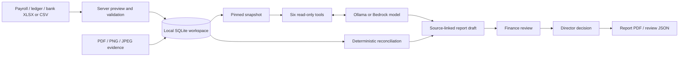

# Implemented Architecture — v2

## Data flow

The browser talks to the same-origin Node.js API. The application binds to `127.0.0.1` and stores data in SQLite using Node 24's `node:sqlite`. XLSX parsing uses ExcelJS; the Bedrock adapter uses the AWS SDK for JavaScript v3. Static hosting alone cannot execute these components.

## Imports and evidence

`server/imports.cjs` normalizes three strict schemas. Payroll retains shared validation from `dist/core.js`; ledger and bank rows require valid dates, positive amounts and SGD. CSV and XLSX imports accept 1–500 rows and files up to 5 MB. Formulas, Excel errors, rich objects and numeric reference IDs are rejected. Multi-sheet workbooks require a sheet choice.

XLSX files are checked for bounded archive expansion and parsed in a worker with a time and memory limit. A valid preview records the file hash, selected sheet, rows and workspace revision. Committing the preview checks the simulated reviewer role and current revision, then replaces one dataset in a transaction. Previews expire after 15 minutes.

Supporting PDFs/images are stored as database blobs. Metadata includes an explicit evidence ID, original filename, media type, size, timestamp and SHA-256 hash. The code verifies supported file signatures and extensions; it does not assess authenticity, extract document text or scan content for malware. Evidence IDs are immutable; replacement requires a new ID and corresponding source edits.

## Reconciliation and financial meaning

`server/business.cjs` produces deterministic findings and totals in integer SGD cents:

- Payroll: expected net equals base pay plus allowances minus entered deductions; paid amount, cost center and evidence references are checked.
- Ledger to bank: a match requires the same nonempty reference, currency, cent amount and direction. A unique one-to-one candidate is required. Duplicate candidates remain ambiguous; unmatched bank rows are also reported. Dates are retained for review but are not part of the matching key.
- Payroll to ledger: each payment reference must link one employee to one expense row with category `payroll` and the same recorded payment amount.
- Supporting files: payroll and ledger evidence references must exist among uploaded files. Missing datasets and missing supporting files block review.

Ledger income less ledger expenses is **net cash movement**, not a statutory profit and loss statement. This model does not implement journal balancing, accruals, account balances, CPF or tax calculations.

## Agent execution

`server/agent.cjs` implements real provider calls: Ollama's local chat API and Bedrock's Converse API. The configured local Ollama URL must be an HTTP loopback address. The adapter checks that the selected installed model supports tools and is not a cloud model. AWS credentials are resolved by the server's SDK credential chain, outside browser code.

The six tool names are `workspace_summary`, `payroll_checks`, `financial_summary`, `bank_reconciliation`, `evidence_index`, and `read_source`. Tool names and arguments are validated; every tool reads the pinned snapshot only. The model chooses tools, the server executes them, and results return to the model for a final draft. The Agent has no mutation, approval, payment, messaging, browsing or credential-access tool.

Each run retains its question, provider/model, prompt version, snapshot, tool arguments/results, result hashes, timestamps and outcome. Runs are bounded to seven model rounds, fourteen tool calls and a five-minute timeout. An answer without a tool call, an empty draft, invalid source citations or exceeded limits causes a failure. A missing citation triggers at most one citation-repair request, within the same limits. The validation note is saved with the run; an invalid citation or a second omission fails the run. Only successful runs create AI reports. Model responses are rendered as text.

Imported text is treated as untrusted data in the system prompt. This instruction and the read-only tool boundary reduce risk; they do not make model prose trustworthy. Citation validation confirms that cited source IDs exist, not that the draft's interpretation or numbers are correct. Evidence tools expose metadata only; uploaded file contents are not sent to the model.

A local-model run remains on the local service path. Choosing Bedrock sends the prompt and requested tool results to AWS. Neither provider is considered verified just because settings exist; a completed live run is the verification boundary. A local anomaly-review run was verified on 25 September 2026 with `qwen3:4b-instruct`: `bank_reconciliation` and `read_source` supplied the source data, and the model correctly described the SGD 200.00 ledger/bank difference in a saved draft. The model exposes a native chat template. Start Ollama with `OLLAMA_GO_TEMPLATE=0` to select that path explicitly; no custom model template is required. See [Validation evidence](VALIDATION.md). No AWS account was connected.

## Persistence, revisions and decisions

SQLite tables store the workspace document, evidence blobs, import previews and Agent runs. Transactional changes protect dataset replacement and report decisions against stale revisions. Imports, edits and evidence uploads increment the workspace revision. Successful Agent reports capture the revision used when the run began, even if a later data change has occurred.

A report contains a frozen source snapshot, deterministic findings and rule versions. Finance may review a current draft only when it has zero blocking findings. A director may approve or return only a finance-reviewed report. Decisions require notes. Historical reports remain readable but cannot receive further decisions; a changed rule version also prevents new decisions on an old report.

The role selector is deliberately a simulation. Server checks enforce workflow transitions for the selected role, but requests do not represent authenticated people. Local history is not an immutable external audit log and can be changed by someone with filesystem access.

## Files and export

The default database is `data/peopleledger.sqlite`; `PEOPLELEDGER_DB` can select another path. Data is independent of browser storage and persists across restart. Browser-local v1 data is not automatically migrated.

Review JSON includes imported rows, evidence metadata, reports, decisions, history and recent Agent runs. It does not embed supporting file bytes. Download evidence individually, or stop the application and copy the whole database directory for a complete local backup. Payroll CSV export uses the shared CSV serializer. PDF output uses the browser's print function.

## Remaining platform work

Production sign-in, verified reviewer identity, tenant separation, hosted storage and backups, document-content analysis, Teams scheduling, recruitment/MyCareersFuture, direct ERP connections and statutory integrations are not implemented. The Bedrock adapter is present; deployed AWS infrastructure is not. [AWS next steps](AWS_NEXT_STEPS.md) describes the account and backend work still required.
