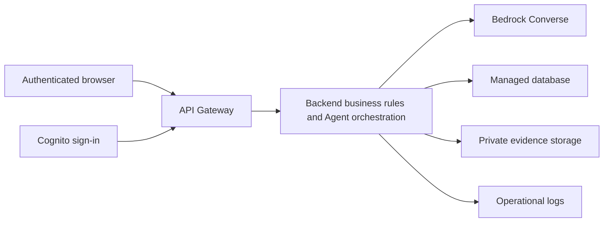

# AWS and External Integration — Next Steps

PeopleLedger v2 has a local Node.js/SQLite backend, file imports, evidence storage, reconciliation and real model-provider adapters. The current user has no available AWS or Microsoft 365 account. No AWS service has been deployed or verified, and no public deployment URL exists.

The completed account-free path is business-file import. Local Ollama inference has completed a live tool-backed drafting run; AWS inference remains unverified. Its setup is described in [Getting started](../START_HERE.md).

## Connect the implemented Bedrock adapter

Once an AWS account is available:

1. Choose a Bedrock model that supports Converse tool use in the target region, and complete the account's model-access requirements. Confirm the model or inference-profile identifier in that account. See [Bedrock model access](https://docs.aws.amazon.com/bedrock/latest/userguide/model-access.html).
2. Configure server-side credentials through the AWS SDK's credential provider chain, such as a local development profile. The code does not accept AWS keys in the browser. See [AWS SDK credentials for Node.js](https://docs.aws.amazon.com/sdk-for-javascript/v3/developer-guide/setting-credentials-node.html).
3. Copy `.env.example` to `.env` and set `AWS_REGION`, `BEDROCK_MODEL_ID` and, when using a named local profile, `AWS_PROFILE`. Keep `.env` outside source control.
4. Grant the exact model invocation access needed. The adapter uses non-streaming Converse with tools; the API requires `bedrock:InvokeModel`. Model and inference-profile resource scope depends on the selected configuration. See [Converse API reference](https://docs.aws.amazon.com/bedrock/latest/APIReference/API_runtime_Converse.html).
5. Restart PeopleLedger. In **AI Agent**, refresh the connection and select the **AWS** model. Use fictional data for the first run and inspect the saved tool trace and draft.
6. Record a successful completed run before changing the integration status from configured to verified. A configured model name alone does not prove credentials, region, model access or inference.

Selecting AWS sends the request and tool results to Bedrock. The prompt and read-only tool boundary are the same as for the local provider. AWS model output still requires human review; the adapter cannot approve reports, alter source records or execute payments.

## Host the complete application

The old static deployment approach is insufficient for v2. The browser now needs API endpoints, SQLite persistence, file storage and a model service. Uploading only `dist/` to Amplify or another static host will display an unavailable-backend message.

The repository does not yet include AWS deployment infrastructure. A production deployment needs an explicit server/storage design rather than uploading the static ZIP. One possible future architecture is:

Implementing this design requires adapting the current loopback HTTP server, replacing local-only storage with suitable hosted persistence, authenticating users, enforcing permissions from verified identities, and setting backup and evidence-access policies. The current role field is user-selected, so it must not become the production identity mechanism. A hosted deployment also needs an appropriate way to run and persist long Agent requests.

Useful official references: [API Gateway Lambda integrations](https://docs.aws.amazon.com/apigateway/latest/developerguide/http-api-develop-integrations-lambda.html), [Cognito user pools](https://docs.aws.amazon.com/cognito/latest/developerguide/cognito-user-pools.html), [API Gateway JWT authorizers](https://docs.aws.amazon.com/apigateway/latest/developerguide/http-api-jwt-authorizer.html), and [Lambda execution roles](https://docs.aws.amazon.com/lambda/latest/dg/lambda-intro-execution-role.html). These describe services to evaluate; they are not resources already provisioned by this project.

After deployment, verify file imports, evidence download, reconciliation, actual model calls, authenticated review decisions and persistence after restart at the deployed URL. Capture the real deployment evidence required by the competition. Never label a locally successful run as an AWS deployment.

## Remaining business-system integrations

| Integration | Current state | Work needed |
| --- | --- | --- |
| Payroll / ledger / bank files | Implemented CSV/XLSX import | Map actual exported files to the supplied schemas and verify field meanings |
| Direct ERP / accounting sync | Not implemented | Select the actual system, obtain authorized account access, implement mapping and incremental synchronization |
| Microsoft Teams / calendar | Not implemented | Obtain a Microsoft 365 tenant and approved access; implement scheduling and explicit human confirmation of invitations |
| Recruitment / MyCareersFuture | Not implemented | Define the job/candidate workflow and permitted data-access method; implement source records, permissions and review steps |
| CPF / tax / government filing | Not implemented | Define the relevant jurisdictional rules and authorized integration; validate calculations and human submission controls |
| Evidence-content analysis | Not implemented | Add document extraction, content validation and page-level references; the current Agent receives metadata only |

A model adapter does not supply these business integrations automatically. The next development phase should follow the actual accounts and systems the team selects.
