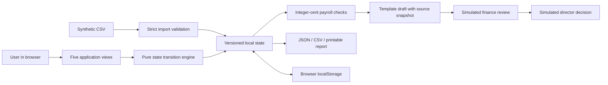

# Implemented architecture

The architecture above is implemented. It has no backend business API and performs no external network requests. The supplied HTTP server is a local static-file server only.

## State and transitions

- `revision` increments after an employee edit or replacement import.
- `check` records the data revision, rule version, timestamp, issue list and totals.
- `reports` retain snapshots. A report is `draft`, `reviewed`, `approved` or `rejected`.
- Finance review is blocked if the snapshot contains outstanding issues.
- Only the simulated director role can decide a reviewed report.
- Each modification/decision requires an explanation. Both record values and before/after changes are retained in local history.
- Data or rule changes make old reports ineligible for approval. A new report must be generated and reviewed.
- Rejection is final for that report version. The finance role creates a new draft for resubmission; previous decisions remain visible.

## Money and data

Amounts are validated as nonnegative decimal strings, at most two decimal places and below SGD 100 million per field. Calculation uses integer cents. A record contains one employee and one payroll month; employee ID is unique within the imported dataset. Multiple months for the same employee in a single import are not supported.

Gross pay = base pay + allowance. Expected net = gross pay − entered deductions. No CPF/tax rule is inferred. At most 500 rows or 1 MB may be imported, and failed validation leaves current state unchanged.

CSV exports prefix formula-leading cells with an apostrophe for spreadsheet safety. Such formula-like text is intentionally not identical on reimport. UI text is escaped before HTML insertion.

## Integrity boundary

Role rules in the JavaScript engine demonstrate transitions, but a browser owner can modify the code or stored state. Local history and client timestamps are not authoritative evidence. Saved-data shape validation prevents common corrupted-state render errors; it is not an authenticity check. A real system must verify identity, permissions, state transitions and source data on a trusted server.

The demo stores only evidence reference strings. A production evidence system would need uploaded files, access checks, object versioning, file integrity metadata and retention policy. See the AWS roadmap for the separate future architecture.

## Extension points

- Preserve deterministic calculations in a trusted server-side module when adding a backend.
- Replace `reportText()` through a server-backed drafting interface while retaining raw source IDs and exact computed totals. The language model should not determine the arithmetic or authorize decisions.
- Replace the role selector with real sign-in and server-enforced permissions.
- Replace localStorage with a versioned database and separately persisted evidence storage.
- Add recruitment, Teams meeting scheduling and expenses as additional business modules after the core workflow is validated.
