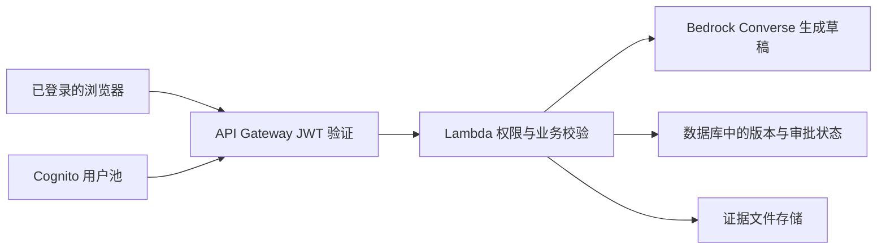

# AWS 部署与后续接入

当前代码是静态网页原型，没有实际调用 AWS 或 AI 模型。以下区分可以直接部署的网页与仍需开发的服务端功能。

## 先部署网页到 AWS Amplify

1. 将 `dist/` 里面的文件压缩成 ZIP。ZIP 根目录须直接包含 `index.html`、`styles.css`、`core.js` 和 `app.js`，不要在最外面再套一个 `dist` 文件夹。
2. 在 AWS Amplify 控制台选择 **Create new app → Deploy without Git → Next → Drag and drop**。
3. 填应用和分支名称，上传 ZIP，选择 **Save and deploy**。
4. 在新的部署地址测试检查、修改、审批和导出。不同地址的浏览器本地数据独立，不会从本地预览自动迁移。
5. 保存实际成功部署的网址和控制台证据，作为比赛部署材料。部署涉及自己的 AWS 账户和资源，须按账户实际配置操作。

官方依据：[Amplify 手动部署](https://docs.aws.amazon.com/amplify/latest/userguide/manual-deploys.html)。

这一步仅托管网页，不会自动提供服务器数据库、多人共享数据、真实身份认证或 AI 推理。

## 后续真实 AI 架构

以上是后续建议，当前仓库没有实现这些 AWS 资源或调用。

接入 Bedrock 时：

- 在目标区域验证 AWS 账号对具体模型的访问。
- 通过服务端 Lambda 执行角色提供凭证，禁止把 AWS 密钥放进网页。
- 使用 Converse API 的 `modelId` 和 `messages` 参数；普通 Converse 所需权限为 `bedrock:InvokeModel`，模型与权限范围按实际部署确认。
- 在调用前由服务端验证用户权限、数据版本和输入；把确定性计算结果、来源编号和待处理问题作为有边界的输入。
- 保存模型、提示词、数据快照、输出版本及人工修改，禁止模型直接批准报告或更改原始薪资。

官方依据：[API Gateway 与 Lambda](https://docs.aws.amazon.com/apigateway/latest/developerguide/http-api-develop-integrations-lambda.html)、[Bedrock Converse](https://docs.aws.amazon.com/bedrock/latest/APIReference/API_runtime_Converse.html)、[模型访问](https://docs.aws.amazon.com/bedrock/latest/userguide/model-access.html)、[Lambda 执行角色](https://docs.aws.amazon.com/lambda/latest/dg/lambda-intro-execution-role.html)。

## 身份与审计

可用 Cognito 用户池处理登录，API Gateway JWT authorizer 校验令牌，再由服务端验证财务与董事职责。应用业务日志应记录操作者身份、源数据版本、报告版本、决策及时间，并在服务端持久化。CloudWatch 运行日志不能单独代替审批证据体系。

官方依据：[Cognito 用户池](https://docs.aws.amazon.com/cognito/latest/developerguide/cognito-user-pools.html)、[API Gateway JWT 验证](https://docs.aws.amazon.com/apigateway/latest/developerguide/http-api-jwt-authorizer.html)、[CloudWatch Logs](https://docs.aws.amazon.com/AmazonCloudWatch/latest/logs/WhatIsCloudWatchLogs.html)。
